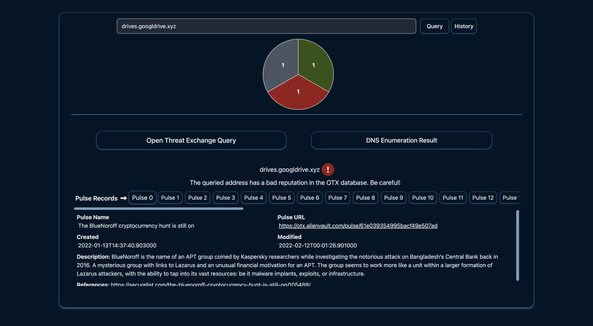

# Domain & IPV4 OTX Query and DNS Enumration
Ever wondered if a website is safe before clicking that link? Are you curious about a domain's history or potential security risks? Look no further! This website ([domaincheck.com.tr](domaincheck.com.tr)) puts the power of open threat intelligence and DNS enumeration in your hands, helping you make informed decisions about online interactions. (Application both support English and Turkish languages. Language will automatically be updated based on your browser's language.)

## Protect Yourself Online: Domain & IP Threat Intelligence at Your Fingertips

**With our tool, you can:**
* Query any domain name or IPV4 address: Quickly check its reputation against major threat databases to see if it's been flagged for malware, phishing, spam, or other malicious activity.
* Get detailed DNS records: Uncover the underlying infrastructure of a domain, including "A", "AAAA", "CNAME", "NS", "MX", "TXT", and "SOA" records, for a deeper understanding of its configuration and potential connections.
* Make informed decisions: Stay safe online by identifying potential threats before they can do harm. Use this information to protect yourself from phishing scams, malware downloads, and other online dangers.


**This website is ideal for:**
* Security professionals: Investigate suspicious domains and IPs, gather evidence for security incidents, and improve your overall situational awareness.
* IT administrators: Protect your organization from online threats by proactively checking the reputation of domains and IPs accessed by your users.
* Individuals: Enhance your online security by making informed decisions about the websites you visit and interact with.

**Get started today:** Simply enter a domain name or IPV4 address in the search bar, and let our tool do the rest. We empower you to take control of your online safety with easy-to-understand information and valuable insights.

## Example

This is a snapshot of the domaincheck.com.tr website. It shows the results of a query for three different URLs.





The pie chart uses the following colors to indicate the risk level:

1. Gray: No information available
1. Red: The queried website is listed as malicious in the Open Threat Exchange (OTX) database. Do not attempt to access this website.
1. Green: The domain or IP address is considered safe because it is validated by certain authorities.

According to the image, one of the queried URLs, drives.google.xyz, is listed as malicious in the OTX database. The website also provides the results of the OTX query and DNS enumeration below the pie chart. **Please note:**

1. The backend server is hosted on a free service. Therefore, it may take some time for your query results to appear. You may need to try multiple times.
1. It takes approximately 30 seconds for the backend server to boot up after the first request is received. 


## Hosting Frontend and Backend Locally

**Requirements:**

1. OTX API Key: Required to access threat intelligence data from the Open Threat Exchange (OTX) database. Obtaining a key might require a free or paid subscription to OTX. See https://otx.alienvault.com/ for details. Update the `API_KEY` variable in the `./backend/api/utils.py` file with your key to access OTX database.
1. Available Ports: Ensure ports `3001` (backend service) and `5173` (frontend service) are not in use by other applications on your local machine. Port conflicts can prevent services from starting.
1. Updated Environment Variables (if applicable): If you change backend service port numbers, update the corresponding value in the .env file. This file stores environment variables used by the application. Also if you update frontend service port numbers, please update `docker-compose.yaml` file accordingly.

**Instructions:**

1. Run the following command in your terminal:

    ```bash
    docker compose up -d
    ```

    This command starts both the frontend and backend services in the background.

1. Access the application in your browser: [http://0.0.0.0:5173/](http://0.0.0.0:5173/)

**Note:** [http://0.0.0.0:5173/](http://0.0.0.0:5173/) might not work on all systems. If you encounter issues, try using [http://localhost:5173/](http://localhost:5173/) instead.
 

**Disclaimer:** This website is provided for informational purposes only and should not be considered a substitute for professional security advice.

*We appreciate your feedback and suggestions. Please let us know what features you would like to see added in the future!*